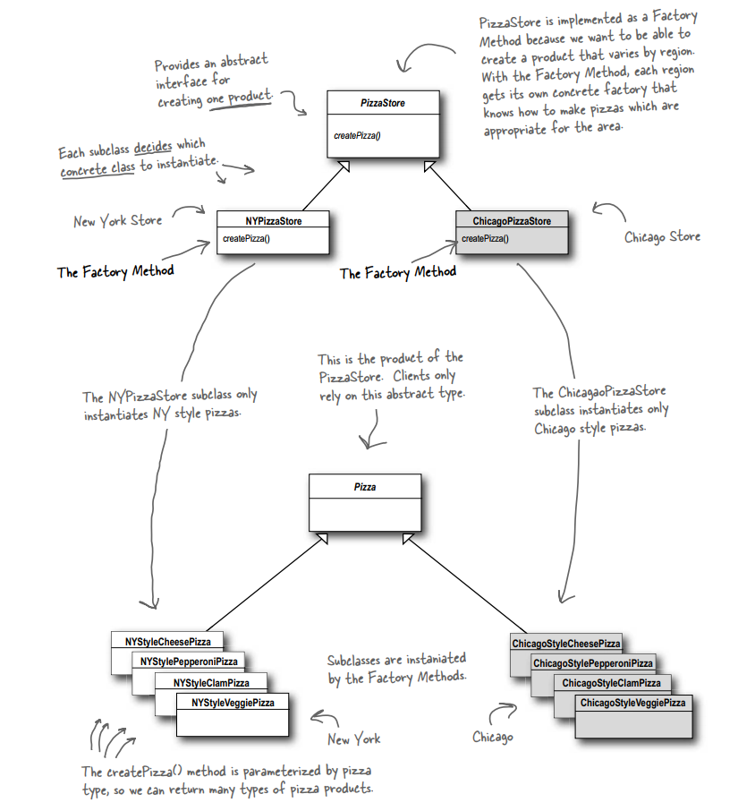
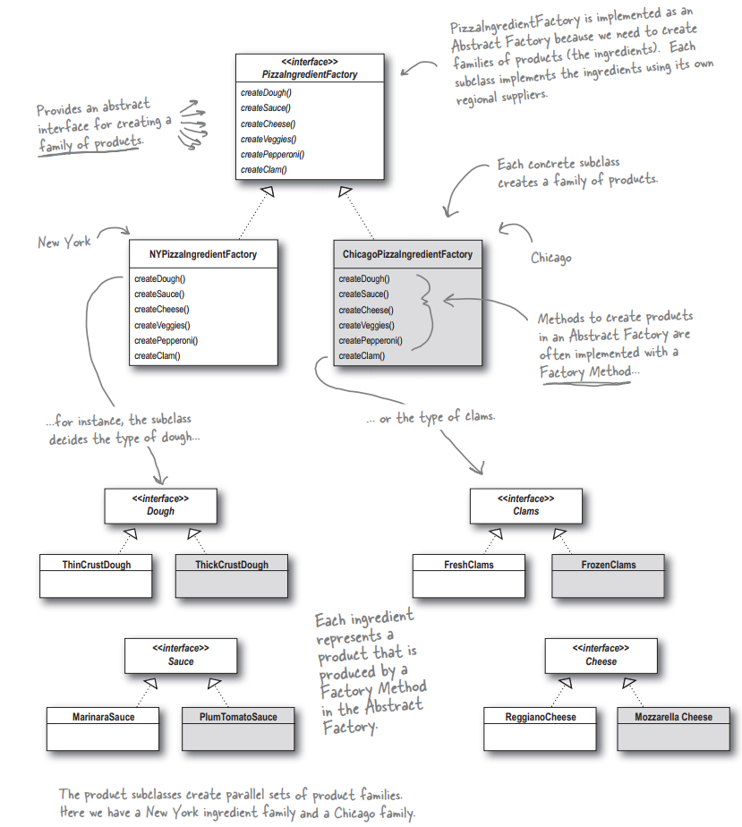

Design Pattern by HeadFirst Design Pattern Book.

# 4. Abstract Factory

```
Provides an interface for creating families of related or dependent object without specifying their concrete class
```


An example for PizzaStore:






Result:


The factory pattern construct a single object != The abstract factory construct multiple objects

As you can see in 2 pictures above, the Abstract Factory actually looks like a Factory Method. Each method is declared
abstract and subclasses override it to create some objects.

The job of an Abstract Factory is to define an interface for creating a set of products. Each method in that interface
is responsible for creating a concrete product, and we implement a subclass of Abstract Factory to supply those
implementations. So factory methods are a natural way to implement your product methods in your factories.

```angular2html
Absctract factory contains multiple factory methods inside
```
