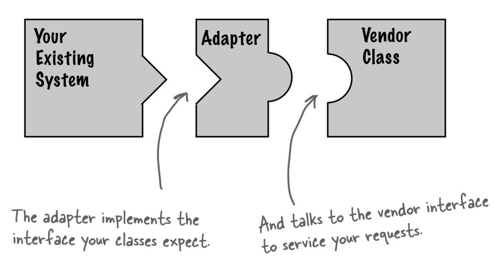
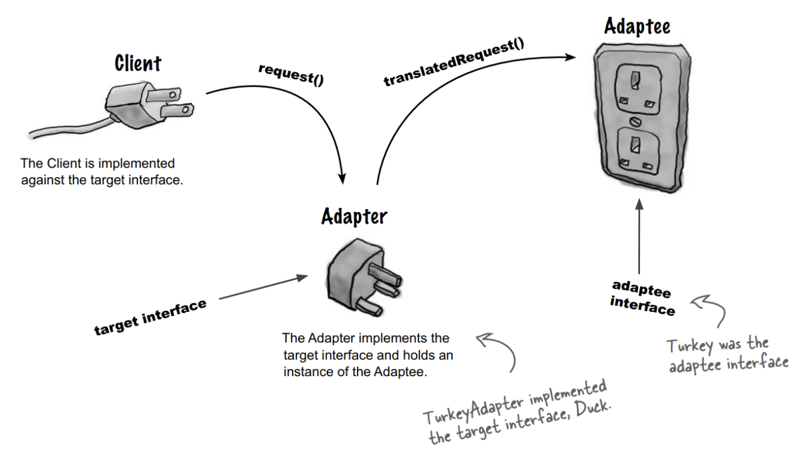
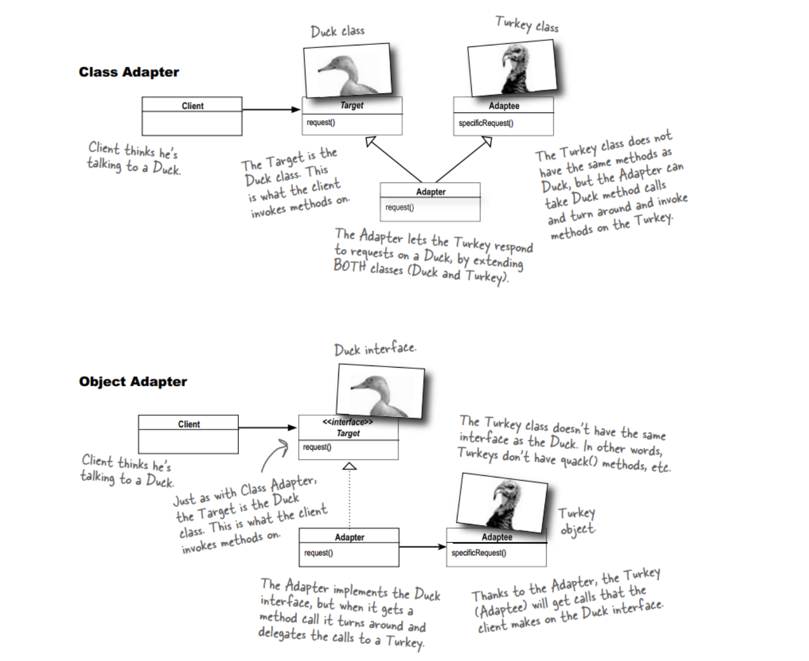

# 6.1 Adapter Pattern (aka Wrapper Pattern)

> The adapter pattern convert the interface of a class into another interface clients expect. Adapter lets classes work together that couldn’t otherwise because of incompatible interfaces.

### Adapter Pattern used when

When a class that you need to use doesn't meet the requirements of an interface.
Exposed to legacy code may encounter an old interface needs to be converted to match new client code *Adapters* allows programming components to work together that otherwise wouldn't because of mismatched interfaces.

Adapter pattern motivation is that we can reuse existing software if we can modify the interface.

#### There are two kinds of Adapters

1. **Class Adapter**
   *uses `inheritance`* [multiple inheritance] *not supported in *java* nor *php*.
   can only wrap a class It cannot wrap an interface since by definition it must derive from some base class.

1. **Object Adapter**
   *uses `Object composition`* composition and can wrap classes or interfaces, or both. It can do this since it contains, as a private, encapsulated member,the class or interface object instance it wraps.

Useful video:
[[Youtube]](https://youtu.be/2PKQtcJjYvc)
