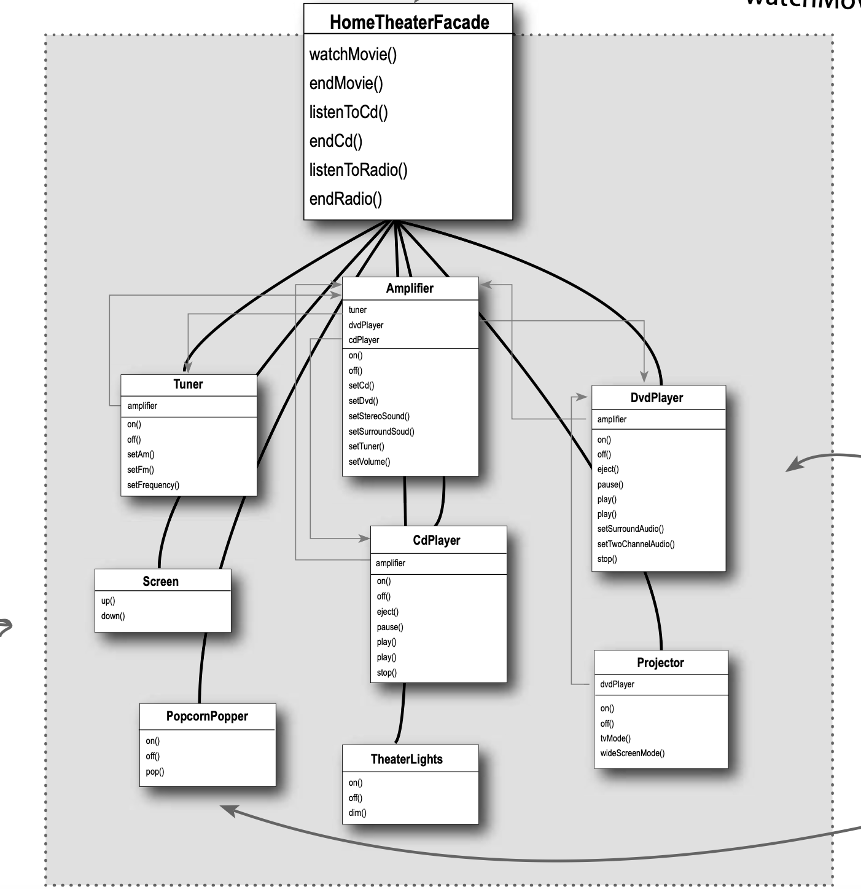

# 7. Facade Pattern (The principle of least knowledge)

Belong to structural pattern.

Provide a unified interface to a set of interfaces in a subsystem. Facade defines a higher-level interface that makes
the subsystem easier to use.

### Facade used when

    when you want to simplify a complex system.

* Facades don't encapsulate .
* Facade Pattern allows to avoid tight coupling between client and subsystem.

From

to

Real example:

Useful video:
[[Youtube]](https://www.youtube.com/watch?v=K4FkHVO5iac&t=470s)
