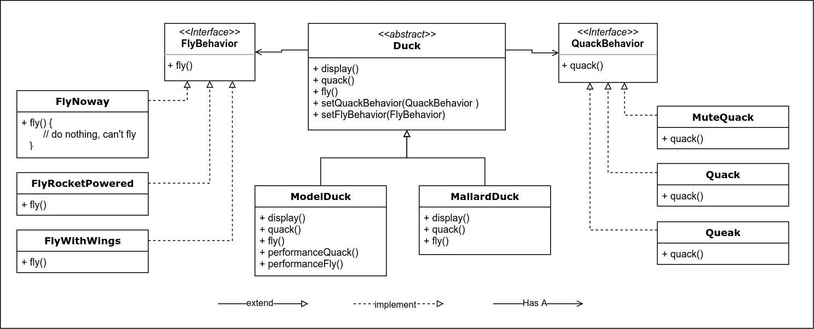
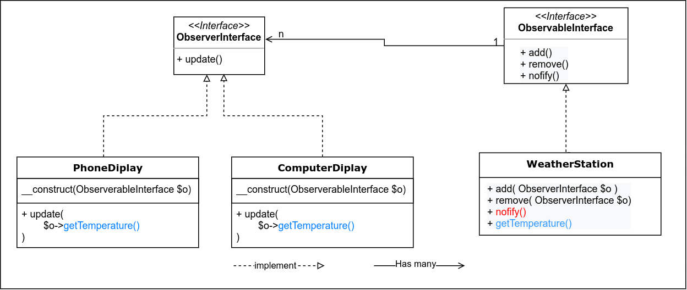

Design Pattern by HeadFirst Design Pattern Book.

# 1. Strategy Pattern (Policy Pattern)

## Design Principle:
- Identify the aspects of your application that vary and seperate them from what stays the same.

    *when you have an codes to change, investigate new requirements carefully then you should know
    what behavior need to separates from code block and what need stays the same.*

## Design Principle:
- Program to an interfacce, not an implementation ( 1 of 5 principals in SOLID )

# 2. Observer Pattern

## Design Principle:
- The observer pattern defines a one-to-many dependency between objects so that when one object changes state, all of its dependents are notified and updated automatically.
