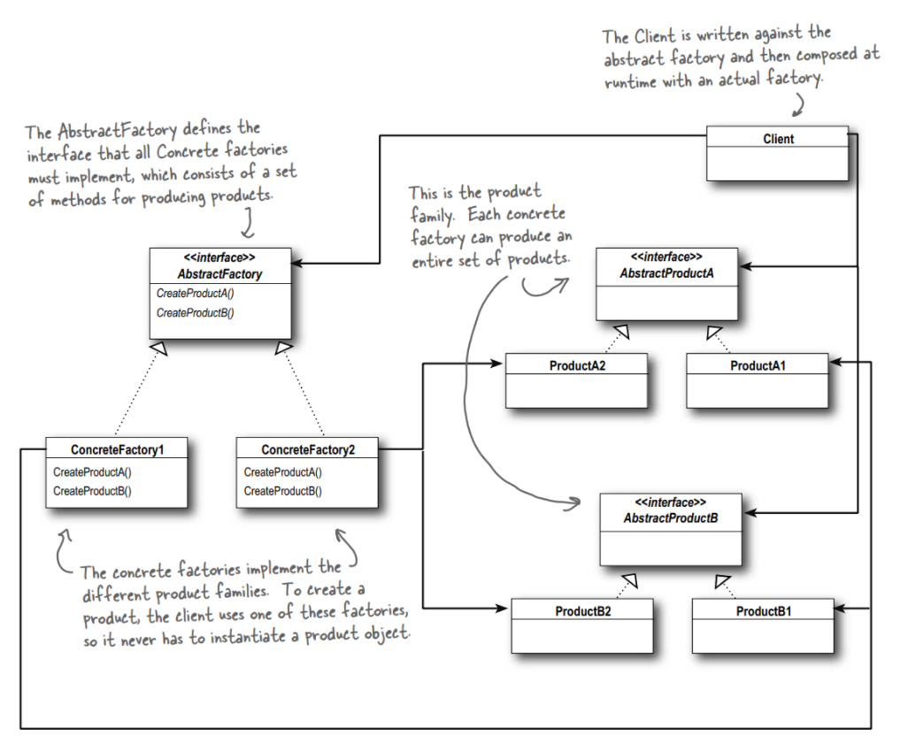
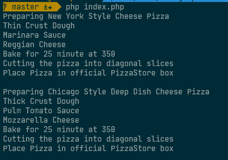

Design Pattern by HeadFirst Design Pattern Book.

# 1. Strategy Pattern (Policy Pattern)


## Design Principle:
- Identify the aspects of your application that vary and seperate them from what stays the same.

    *when you have an codes to change, investigate new requirements carefully then you should know
    what behavior need to separates from code block and what need stays the same.*

## Design Principle:
- Program to an interfacce, not an implementation ( 1 of 5 principals in SOLID )


# 2. Observer Pattern


## Design Principle:
- The observer pattern defines a one-to-many dependency between objects so that when one object changes state, all of its dependents are notified and updated automatically.


# 3. Decorator Pattern

## Design Principle:
- Decorator is a structural design pattern that lets you attach new behaviors to objects by placing these objects inside special wrapper objects that contain the behaviors.

# 4.1 Factory Method (a.k.a Virtual Constructor)

- This part is an example for Factory Method. Part 2 belongs to Aabstract factory is here.

```
This belongs to creational design pattern that provides an interface for creating objects in a supperclass, but allows subclasses to alter/decide type of object that will be created.
```

# Design Principle:

- Depend upon abstractions. Do not depend upon concrete classes.
- Factory Pattern encapsulate object creation

# Real life example:

- Imagine you're using Mysql database connections in your backend system.
- One day customer want to switch to use MYSQL Server for some purposes.
- Then we need create new class for MYSQL Server with existing interface using by Mysql before.
- And edit you backend code to use new connection.
- In future, customer wants to change to other DB connector then you needs to do the same thing above...
- Imagine you have 300 lines of code using this connector, then you need edit all of them, it's terrible.

# Why Factory Pattern helps here:

- Decoupling the creation creation of object/interface from your code.
- When you need to edit, add or remove some connector, just need to edit 1 method without affect other classes.

# Cons:

- Loose Coupling
- Reusability
- Easier to maintain

Design Pattern by HeadFirst Design Pattern Book.

# 4.2 Abstract Factory

```
Provides an interface for creating families of related or dependent object without specifying their concrete class
```



An example for PizzaStore:


Example:



The factory pattern construct a single object != The abstract factory construct multiple objects

As you can see in 2 pictures above, the Abstract Factory actually looks like a Factory Method. Each method is declared
abstract and subclasses override it to create some objects.

The job of an Abstract Factory is to define an interface for creating a set of products. Each method in that interface
is responsible for creating a concrete product, and we implement a subclass of Abstract Factory to supply those
implementations. So factory methods are a natural way to implement your product methods in your factories.

```angular2html
Absctract factory contains multiple factory methods inside
```
